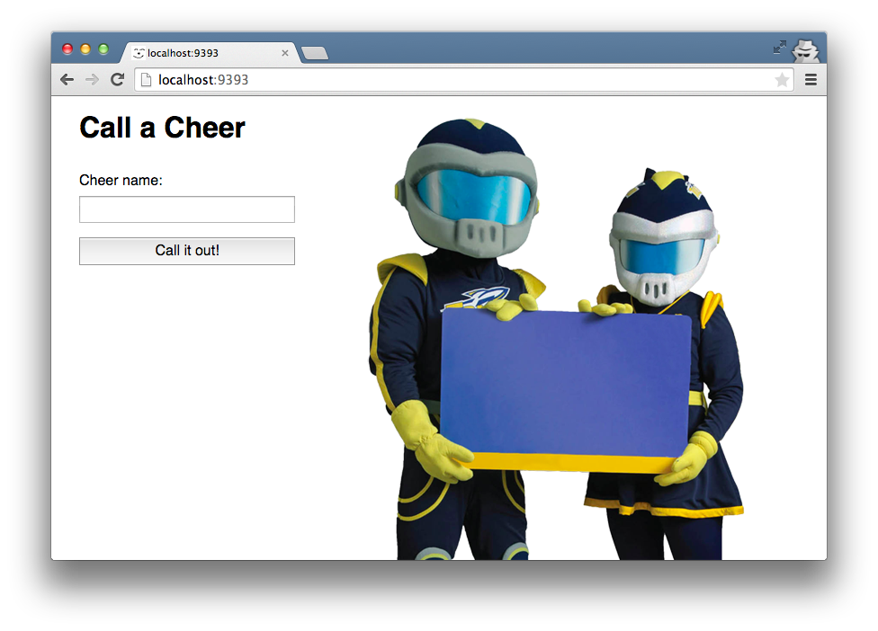

# Cheering Mascot

## Summary

We're going to build a very simple web application using [Sinatra](http://www.sinatrarb.com/documentation.html), a lightweight framework for building web applications in Ruby.  We'll be exploring both how to pass data when making HTTP requests and also how to access data that's been passed with a request.  We'll take a look at both `GET` and `POST` requests.

### Mascot Module
This challenge is a web version of the Cheering Mascot Ruby command line challenge.  In case anyone is unfamiliar with that challenge or needs a refresher, here's an overview.

| CHEER NAME      | SIGN TEXT      |
| :-------------: | :------------: |
| RED HOT         | H-O-T!         |
| DO IT AGAIN     | Go, Fight, Win |
| 2 BITS          | Holler!        |
| STOMP YOUR FEET | STOMP!         |

  *Table 1*.  Cheers for which the mascot has signs.

We are leading some cheers, and we have a mascot helping us by holding up signs that correspond to our cheers.  The mascot only has signs for a handful of cheers.  The mascot will hold up the appropriate sign, if we shout the name of the cheer we want to hear (i.e., type with all caps).  But, if we call out a cheer for which the mascot has no sign or if we don't shout out the name of the cheer loud enough for the mascot to hear, the mascot holds up a generic "Go Team!" sign.

A `Mascot` module has been provided (see `app/models/mascot.rb`).  The purpose of the module is to determine the sign to hold based on the name of a given cheer.

### Sinatra Skeleton
The folder structure of this challenge has been designed to mimic the structure of a Rails application.  At DBC, the Sinatra challenges all share a similar skeleton, so it's worth taking a moment to orient ourselves to how it's organized.

Particularly noteworthy is the `app` directory.  Most of the files we'll be working with will be stored in its subfolders.

- `app/controllers` contains the files where we define how our application will respond to various HTTP requests.

- `app/helpers` contains the files where we define methods shared by our controllers and views.  We won't be defining any in this challenge.

- `app/models` contains the files where we define the classes and modules used in our application.

- `app/views` contains the files where we define templates that we'll convert to HTML and send back as responses to HTTP requests.

### PostgreSQL Database
We won't be creating a database for this challenge.  However, it's worth noting that the Sinatra skeleton uses [Postgres](http://www.postgresql.org/) for its database, not SQLite.  If for some reason there's a database-related error, grab an instructor to make sure the machine is configured correctly and Postgres is running.


## Releases
### Pre-release: Starting the Server with Shotgun
In order to use our application, we need to run a server to handle the HTTP requests we'll be generating in the browser.  Take a look at the `Gemfile`.  Notice two of the entries:  [`thin`](https://github.com/macournoyer/thin/) and [`shotgun`](https://github.com/rtomayko/shotgun).  We're not expected to know how these work. Suffice it to say we'll be running a thin server, and we'll start it with shotgun.

Before we try starting the server, let's make sure that all required gems have been installed. Run `bundle` to install any missing gems.  

To start the server, run the following command from the application's root directory:

```text
$ bundle exec shotgun config.ru
```
*Figure 1*.  Code to start server.

The `config.ru` file loads our environment and runs our application. The `.ru` stands for "rackup". Sinatra, like Rails, is a [Rack-based](http://rack.github.com/) framework, which means the main point of entry is this `config.ru` file. Going forward, we can leave off the `config.ru` and just run `bundle exec shotgun`.  By default, `shotgun` looks for a `config.ru` file.

```text
== Shotgun/Thin on http://127.0.0.1:9393/
Thin web server (v1.6.2 codename Doc Brown)
Maximum connections set to 1024
Listening on 127.0.0.1:9393, CTRL+C to stop
```
*Figure 2*. Console output after starting the server.

When the server starts we should see output similar to that in Figure 2.  The first and last lines contain the most relevant information.  The first line gives us the host and port where we can access our application:  `http://127.0.0.1:9393/`.  The last line informs us how to shut down our server:  `CTRL + C`.

### Release 0: Visit the Homepage



*Figure 3*.  Screenshot of homepage.

We should now be able to visit our web app. Rather than using host `127.0.0.1`, we can use `localhost` which always refers to *the current machine*.  Open the browser and go to `http://localhost:9393`.  Our page should look similar to the screenshot in Figure 3.

So, what's happening here?  When we went to `http://localhost:9393`, the browser sent an HTTP request to the server that we started.  More specifically, it made a `GET` request to the root URL.

```ruby
get '/' do
  @sign_text = params[:sign_text]
  # Look in app/views/index.erb
  erb :index
end
```
Figure 4.  Defining a Sinatra GET handler.

Our server obviously knew how to handle that request.  Let's take a look at the file `app/controllers/index.rb`.  At the top of the file, we'll see the code that appears in Figure 4, which defines a `GET` handler by calling the method [`Sinatra::Base#get`](https://github.com/sinatra/sinatra/blob/master/lib/sinatra/base.rb#L1368).  We're passing the method a path, which is in this case `"/"` and represents the root URL.  We also pass a block.  All together, we're saying that when a `GET` request is made to this specific path, execute this block of code.

What does the block of code do?  First it assigns an instance variable `@sign_text`.  We'll talk more about this in the next release.  Then, we have the line `erb :index`.  We're calling the method [`Sinatra::Templates#erb`](https://github.com/sinatra/sinatra/blob/master/lib/sinatra/base.rb#L665) and passing the name of a template that we want to render.  

The symbol `:index` that were passing corresponds to the name of one of our view templates:  `app/views/index.erb`.  Our template is written in embedded Ruby.  Essentially, our template is plain text with snippets of Ruby code mixed in.  When the template is rendered, the Ruby expressions get evaluated and their return values replace the snippets.

Back to our block of code.  The call to `#erb` renders our template into a string. As this is the last line of code to execute, the rendered string is what our block will return.  And, the return value of the block becomes the body of the response that our server will send back to the browser.


### Release 1: Make Grandma Talk

First, visit [http://localhost:9393/?grandma=hey!](http://localhost:9393/?grandma=hey!).  Notice how the value of the URL parameter `grandma` is rendered on the page.  Try to find where in the code this logic exists.  How do we extract information from the URL parameters?

Note: When you enter a URL in your web browser, it makes an HTTP GET request. Notice how that matches the `get '/'` route defined in `app/controllers/index.rb`?

Try modifying the value of the `grandma` query parameter. What if you change the query parameter name to `grandpa`?

The string after a URL that looks like `?param1=value1&param2=value2` is called a **query string**, and it contains the parameters of the request.

Load up the web app, type something into the talk-to-Grandma box, and click "Say it!"  What happens and why?

### Release 2:  Make Grandma Logical

Finally, change `app/controllers/index.rb` so that after you send a message to Grandma via the form her reponse is displayed via the `app/views/index.erb` template. Take inspiration from the `get '/'` route.

If you typed in something in ALL CAPS make her respond humorously.  If you typed in something else make her response with "Speak up, kiddo!"

Read the [Sinatra documentation][] on [browser redirect][] and the [handlers section][] of the [Sinatra Book][].  You'll want to redirect back to `http://localhost:9292/?grandma=foobar` (where `foobar` is whatever Grandma has to say) after the user submits their form.

### Submit your code!

**Only your `index.rb` file should have changed.**  Create a pull request with your changes.

## Resources

* [Sinatra Online Documentation][Sinatra] (_less-comprehensive but direct_)
* [Sinatra Book][Sinatra Book] (_more comprehensive, but less direct_)

[Sinatra documentation]: http://www.sinatrarb.com/intro
[browser redirect]: http://www.sinatrarb.com/intro#Browser%20Redirect
[handlers section]: http://sinatra-book.zencephalon.com/#handlers
[Sinatra Book]: http://sinatra-book.zencephalon.com/
[Sinatra]: http://www.sinatrarb.com/
